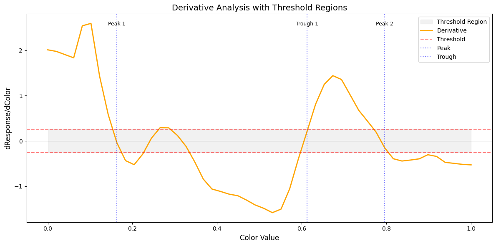

# Neural Color Tuning Analysis

A Python toolkit for analyzing color selectivity and invariance in neural responses from a digital twin of macaque V4 neurons. This project provides tools to characterize how individual neurons respond to color variations in visual stimuli.

## Project Overview

This toolkit analyzes neural responses from a pre-trained CNN model that simulates V4 neural responses to colored images. It focuses on:
- Detecting and characterizing color-selective responses (both excitatory and inhibitory)
- Identifying regions of invariance to color changes
- Visualizing tuning curves with color spectrum analysis
- Quantifying selectivity through tuning curves

## Features

- **Color Response Analysis**
  - Detection of excitatory peaks and inhibitory troughs
  - Identification of color-invariant regions
  - Calculation of tuning sharpness metrics
  - Smoothing and derivative analysis

- **Visualization Tools**
  - Color tuning curves with spectrum overlay
  - Derivative analysis plots
  - Selective and invariant region highlighting
  - Automated peak and trough annotation

- **Reporting**
  - Detailed analysis reports including:
    - Peak/trough characteristics
    - Color selectivity ranges
    - Invariance regions
    - Response metrics

## Installation

1. Install Python dependencies:
```bash
pip install -r requirements.txt
```
2. If not done already, clone and install the repo needed to use the in-silico model
```
git clone -b interview https://github.com/KonstantinWilleke/nnvision.git
pip install -e ./nnvision
```
## Detailed Analysis Method

The color tuning analysis is performed through several key steps:

### 1. Signal Processing
- **Smoothing**: Applies Savitzky-Golay filtering to raw neural responses
  - Window size: 10 points
  - Polynomial order: 2
  - Purpose: Reduces noise while preserving response shape
- **Derivative Calculation**: Computes gradient to identify rate of response change

### 2. Peak Detection
- **Excitatory Responses**
  - Identifies peaks above baseline
  - Uses prominence-based detection to find significant responses
  - Calculates Full Width at Half Maximum (FWHM) for selectivity range
  - Characterizes each peak by:
    - Center (hue value)
    - Response range
    - Peak height
    - Prominence

- **Inhibitory Responses**
  - Detects significant drops below baseline
  - Inverts signal relative to baseline for trough detection
  - Calculates inhibitory ranges using FWHM
  - Characterizes each trough by:
    - Center (hue value)
    - Response range
    - Trough depth
    - Prominence

### 3. Invariance Detection
- Normalizes response derivative by maximum rate of change
- Identifies regions where normalized derivative is below threshold
- Requires minimum width (3 points) for stable regions
- Characterizes regions where neural response remains constant despite color changes

### 4. Tuning Metrics
- **Sharpness Calculation**
  - For excitatory peaks: prominence/height ratio
  - For inhibitory troughs: prominence/depth ratio
  - Higher values indicate more selective color tuning
  - Separate metrics for excitatory and inhibitory responses

### 5. Key Parameters
- `peak_prominence`: Controls sensitivity of peak/trough detection (default: 0.03)
- `deriv_threshold`: Determines invariance region detection (default: 0.15)
- Both parameters can be adjusted based on signal-to-noise ratio and desired sensitivity

### Visualization
The analysis provides two main visualization types:
1. **Tuning Curve Plot**
   - Raw responses
   - Smoothed response curve
   - Color spectrum background
   - Highlighted selective and invariant regions
   - Peak and trough annotations

2. **Derivative Analysis Plot**
   - Response derivative
   - Threshold regions
   - Invariance indicators
   - Peak/trough markers

